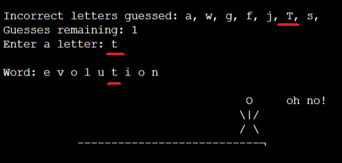
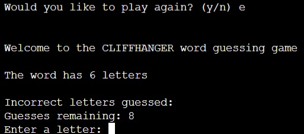

# CliffHanger - Word Guessing Game

CliffHanger is a text based Python terminal game. The program runs in Code Institutes mock terminal on Heroku.

CliffHanger is a new take on the popular Hangman game. 

The players aim is to guess a word with only the amount of letters in that word being known to them.

The players incorrect guesses move the Cliffhanger stick-man closer to the edge of a cliff, with the Stickman taking an unlucky tumble if the player uses up all their attempts at guessing the word.

There is a vast library of words the program has access to, which gives the player a real challenge in solving. Over 170 words!!!

[View the live version of the game here. Enjoy!](https://cliff-hanger-69cb06fcdcfe.herokuapp.com/)

## How to play

If you are familiar with the word guessing game "Hangman" then you will get the gist of Cliffhanger.
If you have never played Hangman, please view the [rules and concept of the game here](https://en.wikipedia.org/wiki/Hangman_(game)#:~:text=Hangman%20is%20a%20guessing%20game,there%20are%20now%20electronic%20versions.).

When the game begins you will be informed of how many letters the word you need to guess contains.

You will then be asked to input a letter.

Upon the letter you input being correct, your correctly guessed letter will be shown and also at what point in the word your letter belongs.

If you guess an incorrect letter, the CliffHanger stick-man will move along the play area and your incorrect guess will be logged.

If you guess too many incorrect letters, the CliffHanger man will take tumble off the cliff and you lose the game.

On guessing the correct word, congratulations, you will be informed you have won the game.

After winning or losing you will be asked if you want to play the game again.

If you select "y" the game will start over and you can play a new game.

If you select "n" you will be shown a message "Thanks for playing" and the game will end.

## Features

### Current Features

- Words are randomly selected from a large library, over 170 word options!

- The player is shown how many letters are in the word they need to guess.

- Correctly guessed letters are show on the word being guessed.

- Incorrect letters are stored and shown to the player, remaining amount of guesses allowed also shown to player.

- Input guesses are validated, if the player has already guessed the letter, they will be informed and asked to guess again.

- Upon reaching the end of the game - after either a win or loss. The player will be asked if they want to play again. 
- If the player want to play again, the game will start again. 

- If the player doesn't want to play again the game will exit with a message, "Thanks for playing".

### Furture Features

Allow the play to select the difficulty of the game. 
With this suggestion:
- 6 attempt - Hard
- 8 attempts - Medium (current format)
- 10 attempts - Easy

## Data Model

The game harnesses the "random" module to select a word at random.

The words are stored in a library which are in their own .py file. This is to keep that data free from cluttering the main code and prevent the risk of misakes being made on main code if library is editied.

Visual representation of an incorrect guess is used by having the stick-man shown and also have it move along the play area with each bad guess.
This is done by an if statement that prints the cliffhanger_display(+1) with each incorrect guess.

Game progress is stored and shown to the player.

Upon game outcome, the game loop is either restarted or exited depending on user input.

#### Logic Flowchart

## Testing

The game has been consitantly tested throughout the projects development.

- The code has been passed through PEP8, the application is showing errors for multiple trailing backslashes, where there are none.
- PEP8 is also showing errors for the double "//" for the stickmans arms or legs, although the code works fine in Heroku terminal.
- Testing has been conducted numerous times and final commit comtains no major bugs.

### Bugs

#### Solved Bugs

- Error corrected due to " / " on stickman. This was resolved by adding an additional "/" 
- Exit loop after win and player not wanting to play again. Fixed by adding break under that specific if condition.

#### Remaining Bugs

- Inconsistancy in uppercase input. Some uppercase letters are acce pted bu not all. 

- Any letter input when asked play again (with the exception of n) will be accepted as a yes "y". No "n" is currently working correctly, however.

### Validator Testing

- PEP8 has been used for testing - errors are stated, however the code works in the Heroku terminal.

## Deployment

Codeanywhere was used to develop the game.
GitHub used to deposit to repository.
Heroku is used to display game code in terminal.

- Steps used to deploy on Heroku
    - Heroku account set up.
    - New App created on Heroku.
    - Buildpacks for python and NodeJS added to app.
    - GitHub linked to Heroku account.
    - Specific GitHub repository selected.
    - Deploy branch to load code into Huroku app.
    - Uploaded repository then viewed.

## Credits

All learnings and techniques were learnt with the Python Essentials and Love Sandwiches project.
With the exception of importing a .py file containing words which was learned from textbook
[Python Programming for beginners - Mark Reed](https://www.amazon.co.uk/Python-Programming-Beginners-Step-Step/dp/B0B7QPFY8K/ref=sr_1_4?crid=1OJGZJVPAXBHA&keywords=python+programming+mark+reed&qid=1705352091&sprefix=python+programming+mark+reed%2Caps%2C63&sr=8-4) Chapter 8.