# CliffHanger - Word Guessing Game

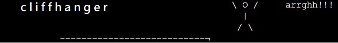

CliffHanger is a text-based Python terminal game. The program runs in Code Institutes mock terminal on Heroku.

CliffHanger is a new take on the popular Hangman game. 

The player's aim is to guess a word with only the amount of letters in that word being known to them.

The players incorrect guesses move the Cliffhanger stick-man closer to the edge of a cliff, with the Stickman taking an unlucky tumble if the player uses up all their attempts at guessing the word.

There is a vast library of words the program has access to, which gives the player a real challenge in solving. Over 170 words!!!

[View the live version of the game here. Enjoy!](https://cliff-hanger-69cb06fcdcfe.herokuapp.com/)

## How to play

If you are familiar with the word guessing game "Hangman" then you will get the gist of Cliffhanger.
If you have never played Hangman, please view the [rules and concept of the game here](https://en.wikipedia.org/wiki/Hangman_(game)#:~:text=Hangman%20is%20a%20guessing%20game,there%20are%20now%20electronic%20versions.).

When the game begins you will be informed of how many letters the word you need to guess contains.

You will then be asked to input a letter.

Upon the letter you input being correct, your correctly guessed letter will be shown and at what point in the word your letter belongs.

If you guess an incorrect letter, the CliffHanger stickman will move along the play area and your incorrect guess will be logged.

If you guess too many incorrect letters, the CliffHanger man will take tumble off the cliff, and you lose the game.

On guessing the correct word, congratulations, you will be informed you have won the game.

After winning or losing you will be asked if you want to play the game again.

If you select "y" the game will start over, and you can play a new game.

If you select "n" you will be shown a message "Thanks for playing" and the game will end.

## Features

### Current Features

- Words are randomly selected from a large library, over 170 word options!

- The player is shown how many letters are in the word they need to guess.

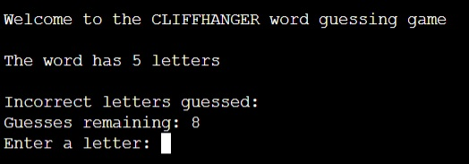

- Correctly guessed letters are show on the word being guessed.

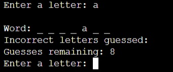

- Incorrect letters are stored and shown to the player, remaining numnber of guesses allowed also shown to player.

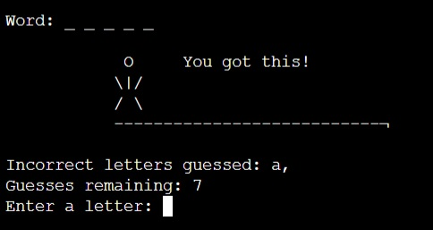

- Input guesses are validated, if the player has already guessed the letter, they will be informed and asked to guess again.

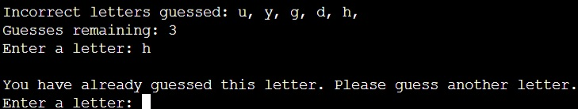

- Upon reaching the end of the game - after either a win or loss. The player will be asked if they want to play again. 
- If the player wants to play again, the game will start again. 

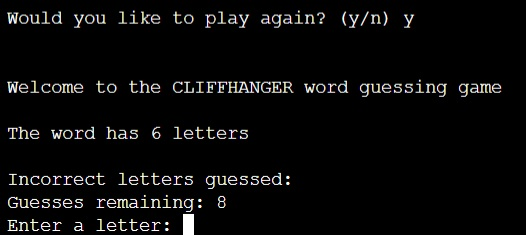

- If the player doesn't want to play again the game will exit with a message, "Thanks for playing".

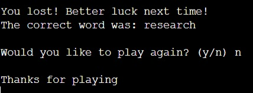

### Future Features

Allow the player to select the difficulty of the game. 
With this suggestion:
- 6 attempt - Hard
- 8 attempts - Medium (current format)
- 10 attempts - Easy

Allow the player to add words of their own to the library.

## Functions

Following the assessors feedback functions were implemented.

* get_word

The get_word function selects a random word from a list of words in word_library and returns it in lowercase.

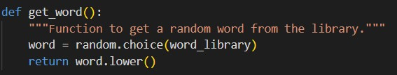

* display_hangman

The display_cliffhanger function displays the current visual state of the cliffhanger hangman based on the number of incorrect guesses made by the player. The first stage of the hangman is now displayed at the start of the game to give the player the visuals prior to an incorrect guess.

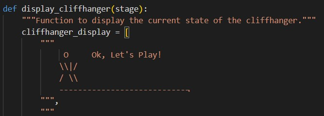

* display_word

The display_word function shows the current state of the word being guessed by displaying correctly guessed letters and underscores for remaining letters.

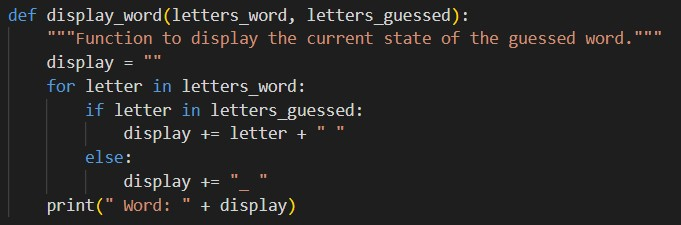

* get_user_input

The get_user_input function prompts the player to enter a valid letter guess and makes sure that the input is appropriate and has not been guessed before.

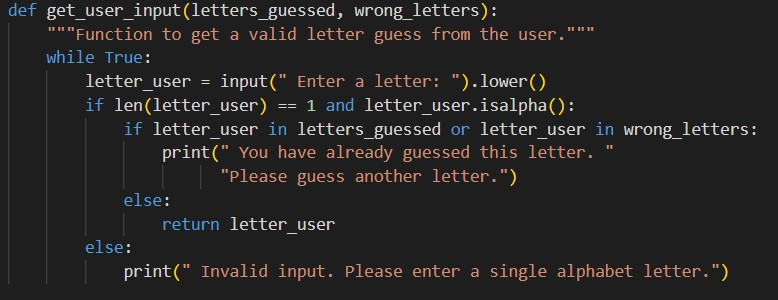

* play_game

The play_game function manages the main logic of the Cliffhanger game, handling the game flow from start to end, including guessing letters, updating the game state, and determining win or loss conditions.

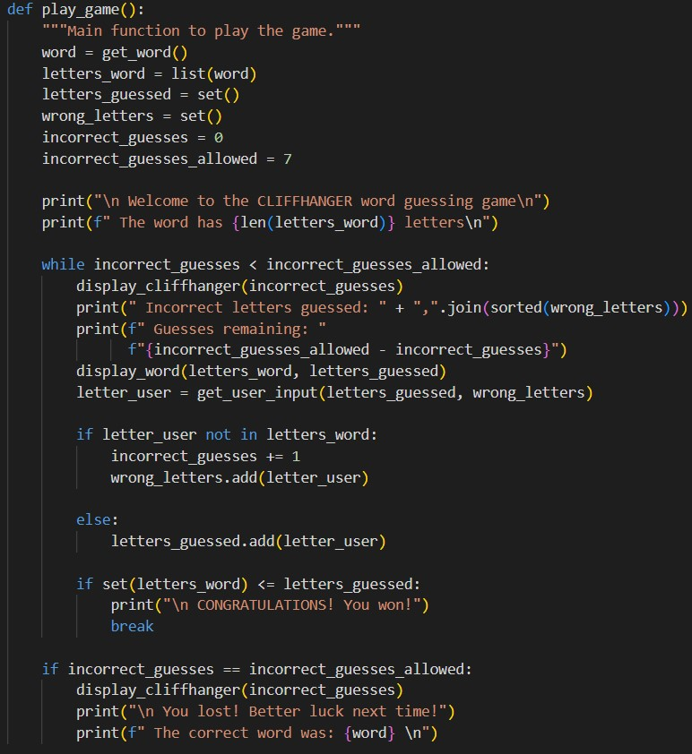

* main

The main function manages the overall game loop and handles the replay functionality, allowing the player to play multiple rounds of the game.

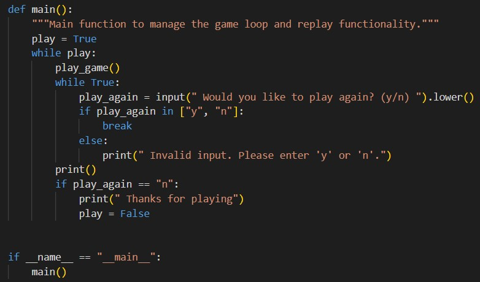

## Data Model

The CliffHanger game has a structured data model to manage the game, track progress, and ensure smooth gameplay. Below are the key components of the data model:

### Word Selection

* Random Module: The game uses Python's random module to select a word at random from a predefined list.
* Word Library: Words are stored in a separate words.py file, keeping the main code clean and reducing the risk of errors during editing. This approach also allows for easy expansion of the word list.

### Visual Representation

* Cliffhanger Display: The visual state of the stickman is represented through a series of strings in a list called cliffhanger_display. Each string corresponds to a stage of the game, showing the stickman's progression towards the cliff edge with each incorrect guess.
* Dynamic Display Update: The game uses an if-statement to update and print the appropriate visual stage from the cliffhanger_display list based on the number of incorrect guesses.

### Game Progress

* Letters Guessed: The game maintains sets for letters_guessed and wrong_letters to track the letters the player has guessed correctly and incorrectly.
* Current Word State: The current state of the word being guessed is displayed using underscores for unguessed letters and the actual letters for correctly guessed ones.

### Game Logic

* Main Game Loop: The main game logic is in the play_game function. This loop continues until the player either guesses the word correctly or used all allowed incorrect guesses.
* User Input: User input is validated to ensure it is a single alphabet letter that hasn't been guessed before.
* Feedback: The game provides real-time feedback to the player, displaying the current state of the word, incorrect guesses, and the remaining number of guesses.

### Game Outcome

* Winning Condition: If the player guesses all letters in the word correctly, a congratulations message is displayed, and the game asks the player to play again.
* Losing Condition: If the player reaches the maximum number of incorrect guesses, the final state of the cliffhanger is displayed, and the correct word is revealed.

### Replay Functionality

* Replay Prompt: After each game round, the player is asked whether they want to play again. The game loop is either restarted or exited based on the player's input.
* Input Validation: Ensures that only valid responses ('y' or 'n') are accepted for the replay prompt, enhancing the user experience and preventing unintended behavior.

#### Logic Flowchart

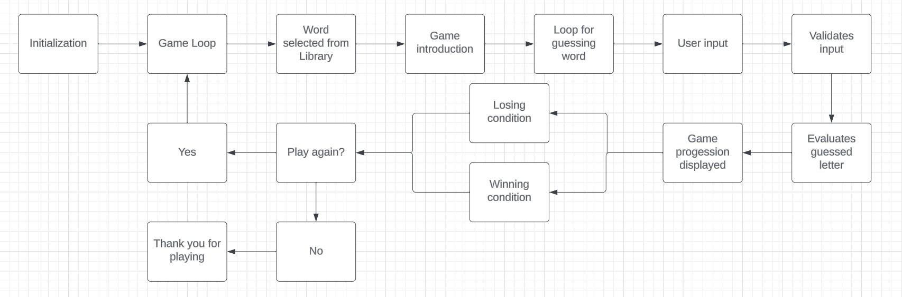

## Testing

### Manual Testing

Manual tests were performed to ensure the game functions correctly. The following scenarios were tested:

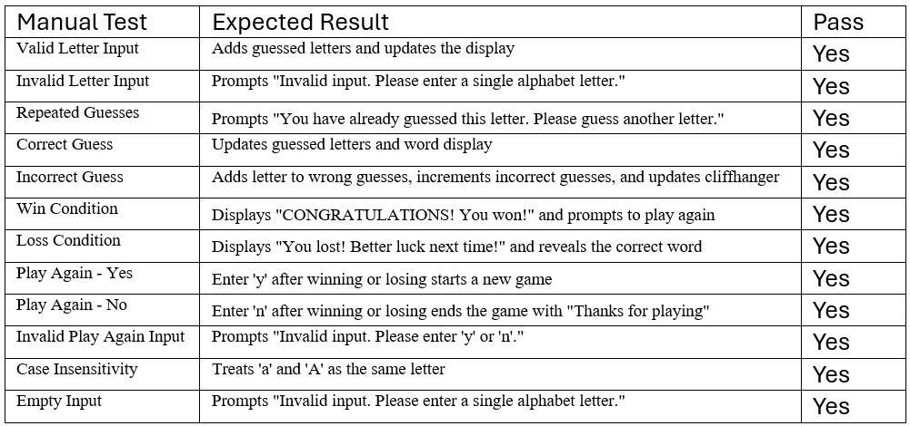

### Validation

Code was validated using PEP8 linter to ensure it adheres to Python coding standards.

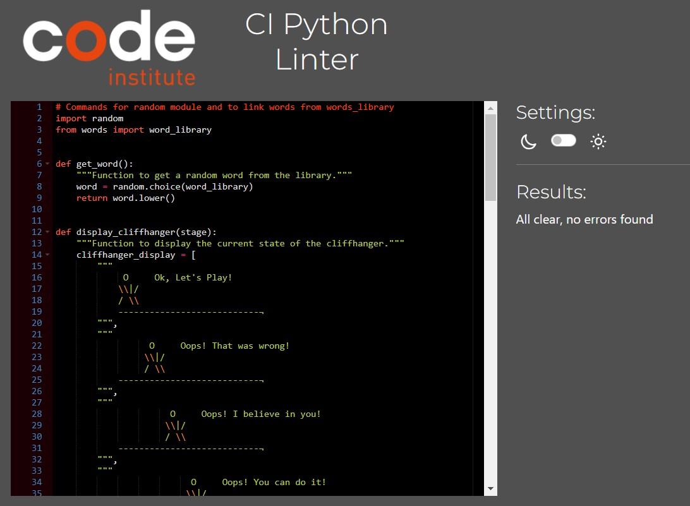

### Bugs

#### Solved Bugs

Following the assessors feedback the following issues has been resolved:

- **Exit loop after win and player not wanting to play again.** Fixed by adding break under that specific if condition when the player does not want to play again.
- **Functionality Bugs.** There were minor bugs affecting the overall functionality, including the incorrect display of the cliffhanger state after a correct guess.
- **Inconsistent Line Spacing and Indentation.** Code was refactored to ensure consistent spacing and indentation, passing PEP8 linter checks.
- **User feedback and issue handling invalid inputs.** There was no proper feedback for invalid inputs, and the function could break if empty or invalid data was entered.
- **Inconsistent flow of data between functions.** There was no proper feedback for invalid inputs, and the function could break if empty or invalid data was entered.
- **User could bypass the play again prompt.** Users could bypass the play-again prompt and continue guessing letters on an already guessed word.
- **Stickman Display Error.** Resolved by adding an additional "/" to ensure correct rendering.
#### Remaining Bugs

All bugs have been resolved

## Deployment

Codeanywhere was used to develop the game.
GitHub used to deposit to repository.
Heroku is used to display game code in terminal.

- Steps used to deploy on Heroku
    - Heroku account set up.
    - New App created on Heroku.
    - Buildpacks for python and NodeJS added to app.
    - GitHub linked to Heroku account.
    - Specific GitHub repository selected.
    - Deploy branch to load code into Huroku app.
    - Uploaded repository then viewed.

## Credits

All learnings and techniques were learnt with the Python Essentials and Love Sandwiches project.
With the exception of importing a .py file containing words which was learned from textbook
[Python Programming for beginners - Mark Reed](https://www.amazon.co.uk/Python-Programming-Beginners-Step-Step/dp/B0B7QPFY8K/ref=sr_1_4?crid=1OJGZJVPAXBHA&keywords=python+programming+mark+reed&qid=1705352091&sprefix=python+programming+mark+reed%2Caps%2C63&sr=8-4) Chapter 8.